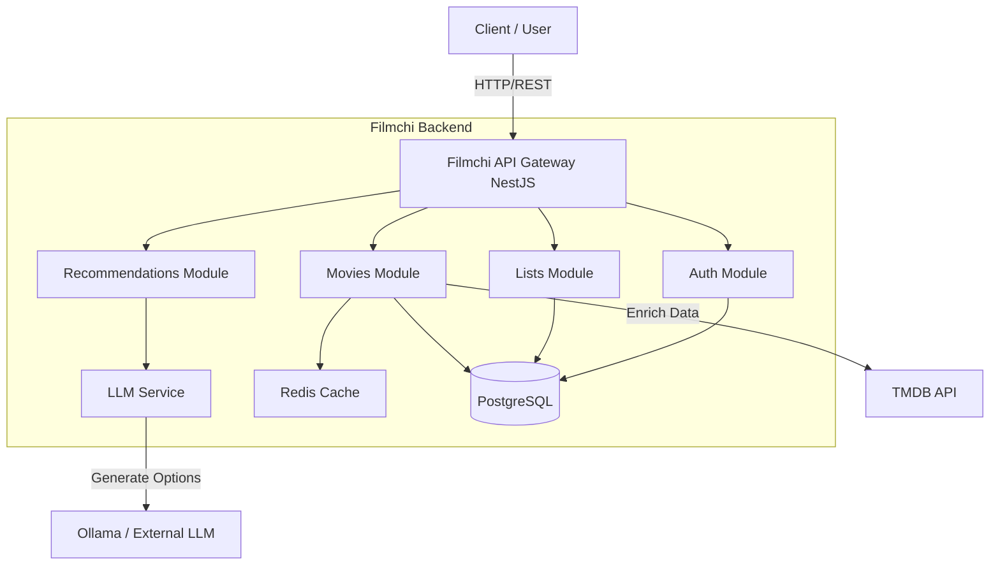

# 00. Project Overview

**Persian (فارسی):** [۰۰. نمای کلی پروژه](00-Overview.fa.md)

---

## 1. Purpose & Scope
**Filmchi Backend API** is the intelligent core of a movie discovery platform. Unlike traditional CRUD applications, it serves as a **smart aggregator and personalization engine**. Its primary purpose is to bridge the gap between static movie databases (TMDB) and dynamic user intent (Natural Language Queries), while providing a robust user management system.

**Key Goals:**
- **Smart Discovery:** Translate vague user feelings (e.g., "sad movies from the 90s") into concrete movie recommendations using LLMs.
- **Performance:** Minimizing latency and external API costs via an aggressive "Cache-Aside" architecture (Redis + Local DB).
- **Personalization:** Maintaining user history, ratings, and lists to refine future recommendations.
- **Privacy:** Granular control over user data visibility.

## 2. Stakeholders & Actors
| Actor | Role | Capabilities |
|-------|------|--------------|
| **Guest User** | Unauthenticated Visitor | Search movies, view trending/popular lists, view genres. |
| **Registered User** | Authenticated Member | Maintain lists (watchlist/watched), rate movies, get AI recommendations, customize profile. |
| **Admin** | System Administrator | (Implied) Manage user accounts, specialized content filters (implied by soft-delete flows). |
| **External System** | TMDB API | Source of truth for movie metadata (titles, posters, dates). |
| **AI Provider** | Ollama / LLM | Intelligence layer for interpreting natural language queries. |

## 3. High-Level Architecture
The system follows a **Modular Monolith** architecture built on NestJS.

## 4. Repository Map & Module Inventory
The codebase is organized by domain modules (feature-sliced).

| Module | Directory | Key Responsibilities |
|--------|-----------|----------------------|
| **Auth** | `src/auth/` | JWT issuance, Refresh token rotation, Hashing (`auth.service.ts`, `jwt.strategy.ts`). |
| **Users** | `src/users/` | Profile management, Preferences, User data export (`users.controller.ts`). |
| **Movies** | `src/movies/` | TMDB integration, Offline caching (`tmdb-movie` entity), Search, Trending lists. |
| **Lists** | `src/lists/` | User lists (Watchlist, Watched), List items (`lists.service.ts`). |
| **Recommendations** | `src/recommendations/` | Orchestration of LLM suggestions + TMDB enrichment. |
| **LLM** | `src/llm/` | Provider agnostic AI interface (Ollama implemented). |
| **Common/Core** | `src/cache/`, `src` | Redis setup, Global filters, Logging, Configuration. |

**Key Configuration Files:**
- `package.json`: Scripts for build, test, migration.
- `docker-compose.yml`: Infrastructure setup (Postgres, Redis).
- `src/app.module.ts`: Root module wiring and Joi validation for ENV.
- `src/main.ts`: Entry point, Swagger, Helmet, global pipes.

## 5. Documentation Map (Engineering)
- **Architecture & system diagram:** [03-Architecture.md](03-Architecture.md) · [فارسی](03-Architecture.fa.md)
- **UML (Use Case, Class, Sequence, Activity):** [10-UML-Diagrams.md](10-UML-Diagrams.md) · [فارسی](10-UML-Diagrams.fa.md)
- **API & database design:** [04-API-Spec.md](04-API-Spec.md) · [فارسی](04-API-Spec.fa.md), [05-Database-ERD.md](05-Database-ERD.md) · [فارسی](05-Database-ERD.fa.md)
- **Testing & evaluation:** [06-Testing.md](06-Testing.md) · [فارسی](06-Testing.fa.md), [09-Evaluation.md](09-Evaluation.md) · [فارسی](09-Evaluation.fa.md) (cache impact, prompt evaluation)
