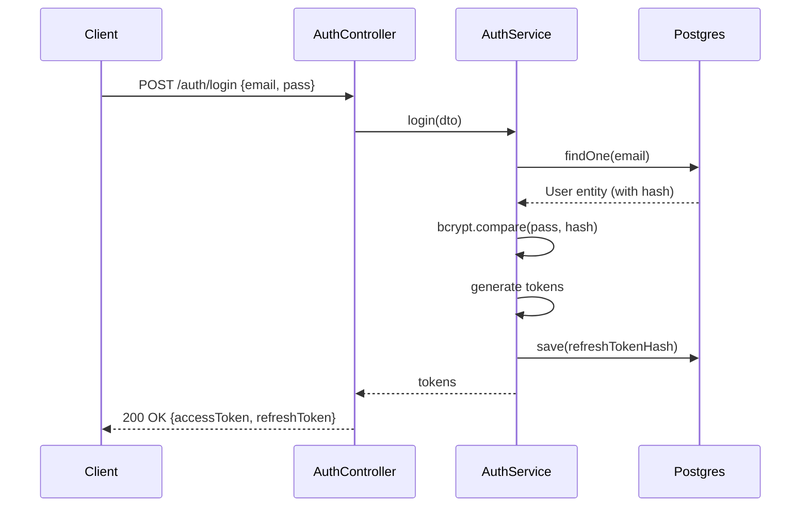
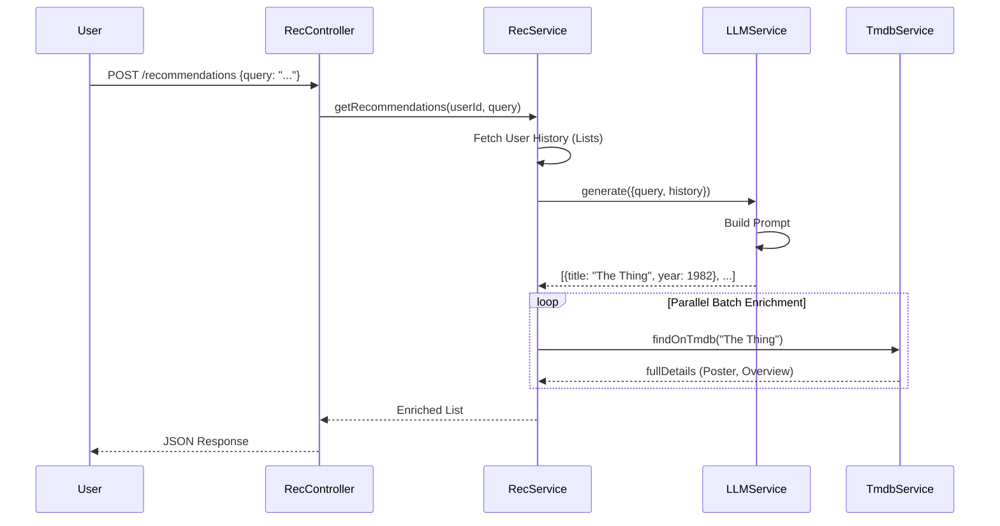
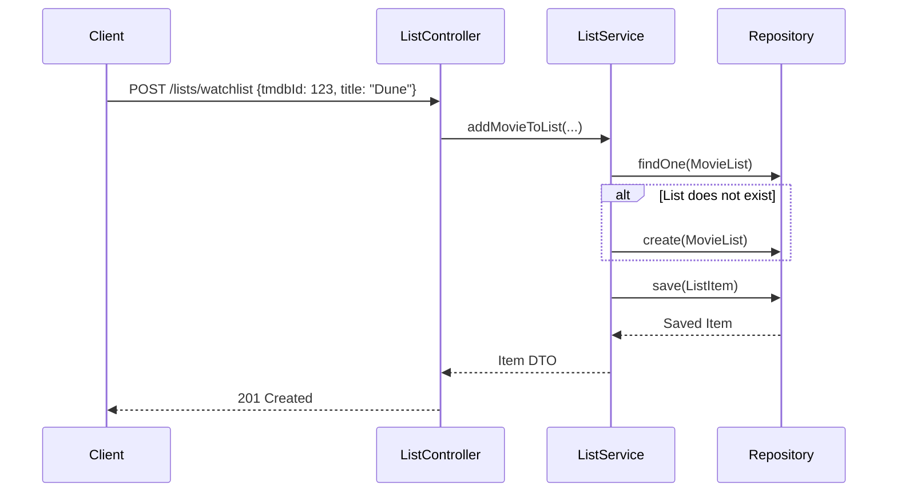

# ۰۲. موارد استفاده

**English:** [02. Use Cases](02-UseCases.md)

---

## ۱. احراز هویت

### UC-01: ورود کاربر
- **پیش‌شرط:** کاربر ثبت‌نام کرده است.
- **جریان اصلی:**
  ۱. کاربر ایمیل + پسورد ارسال می‌کند.
  ۲. سیستم تطابق هش با DB را بررسی می‌کند.
  ۳. سیستم توکن دسترسی (کوتاه‌عمر) و توکن رفرش (بلندعمر) تولید می‌کند.
  ۴. سیستم `refreshTokenHash` کاربر را در DB به‌روز می‌کند.
- **پس‌شرط:** کاربر توکن معتبر دارد.

### UC-02: تمدید توکن
- **پیش‌شرط:** توکن دسترسی منقضی شده، توکن رفرش معتبر.
- **جریان اصلی:**
  ۱. کلاینت توکن رفرش می‌فرستد.
  ۲. سیستم امضا و `tokenVersion` را بررسی می‌کند.
  ۳. سیستم توکن را می‌چرخاند: توکن رفرش جدید تولید، `tokenVersion` افزایش.
- **جایگزین:** در صورت استفادهٔ مجدد از توکن قدیمی، باطل‌سازی (با بررسی نسخه).

## ۲. پیشنهادها

### UC-03: دریافت پیشنهاد هوشمند
- **پیش‌شرط:** کاربر وارد شده، Ollama در حال اجرا.
- **جریان اصلی:**
  ۱. کاربر کوئری می‌فرستد مثلاً «فیلم ترسناک دهه ۸۰».
  ۲. سیستم واچ‌لیست + تاریخچهٔ تماشاشده را می‌گیرد.
  ۳. سیستم با کوئری + تاریخچه به LLM پرامپت می‌دهد.
  ۴. LLM لیست عنوان برمی‌گرداند.
  ۵. سیستم عنوان‌ها را با دادهٔ TMDB (پوستر، ID) به‌صورت موازی غنی می‌کند.
  ۶. JSON غنی‌شده برمی‌گردد.

## ۳. مدیریت لیست

### UC-04: افزودن فیلم به لیست
- **پیش‌شرط:** کاربر وارد شده.
- **جریان اصلی:**
  ۱. کاربر یک فیلم (TMDB ID) انتخاب می‌کند.
  ۲. کاربر لیست هدف (مثلاً «واچ‌لیست») را انتخاب می‌کند.
  ۳. سیستم وجود لیست را بررسی می‌کند (ساخت lazy).
  ۴. سیستم آیتم را به لیست اضافه می‌کند.

## ۴. سایر موارد استفاده
- **UC-05: مشاهده جزئیات فیلم** (مسیر کش: Redis → DB → TMDB).
- **UC-06: امتیاز به فیلم** (Upsert `MovieRating`).
- **UC-07: جستجوی فیلم** (فیلتر ژانر/سال → کش → TMDB).
- **UC-08: خروجی داده** (JSON تجمیعی از کل فعالیت کاربر).

