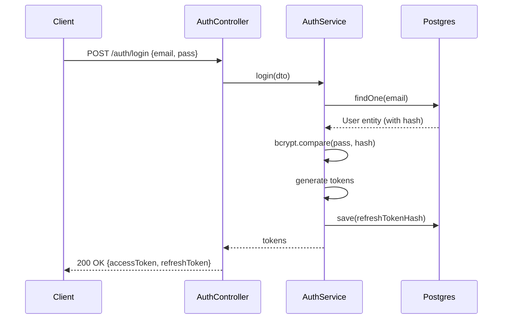
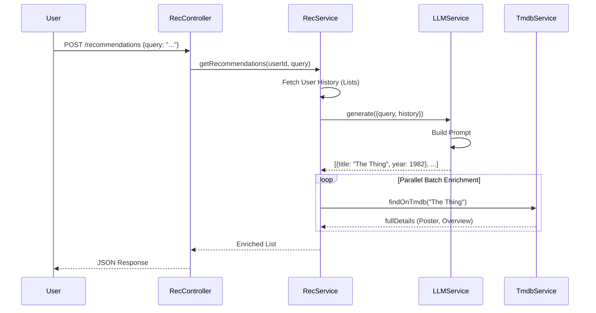
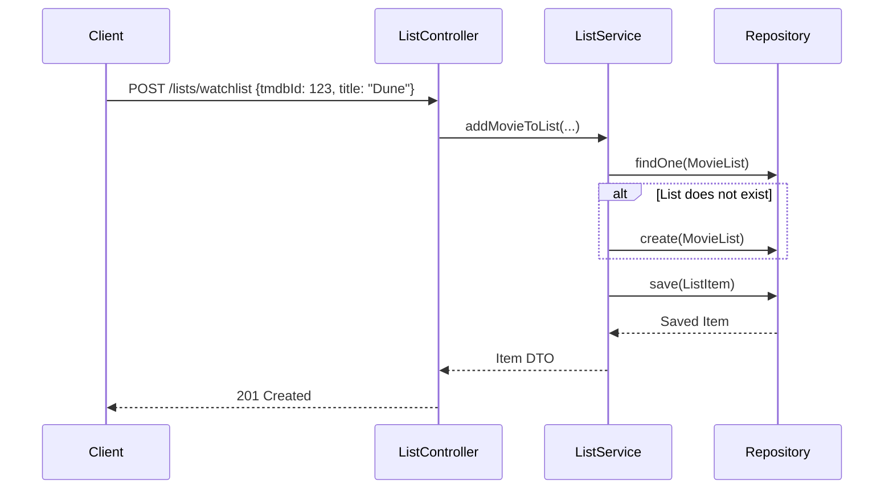

# 02. Use Cases

**فارسی (Persian):** [۰۲. موارد استفاده](02-UseCases.fa.md)

---

## 1. Authentication

### **UC-01: User Login**
- **Preconditions:** User is registered.
- **Main Flow:**
  1. User submits Email + Password.
  2. System validates hash matches DB.
  3. System generates Access Token (short-lived) and Refresh Token (long-lived).
  4. System updates user's `refreshTokenHash` in DB.
- **Postconditions:** User has valid tokens.

### **UC-02: Refresh Token**
- **Preconditions:** Access token expired, Refresh token valid.
- **Main Flow:**
  1. Client sends Refresh Token.
  2. System verifies signature and `tokenVersion`.
  3. System rotates token: generates NEW Refresh Token, increments `tokenVersion`.
- **Alternatives:** If reusing old token, invalidation occurs (implied by version check).

## 2. Recommendations

### **UC-03: Get AI Recommendations**
- **Preconditions:** User logged in, Ollama running.
- **Main Flow:**
  1. User sends query "Scary movies from 80s".
  2. System fetches User's Watchlist + Watched History.
  3. System prompts LLM with Query + History.
  4. LLM returns list of titles.
  5. System enriches titles with TMDB data (Posters, IDs) in parallel.
  6. Returns enriched JSON.

## 3. List Management

### **UC-04: Add Movie to List**
- **Preconditions:** User logged in.
- **Main Flow:**
  1. User selects a movie (TMDB ID).
  2. User selects target list (e.g., "watchlist").
  3. System checks if list exists (lazy creation).
  4. System adds item to list.

## 4. Other Use Cases
- **UC-05: View Movie Details** (Cached traversal: Redis -> DB -> TMDB).
- **UC-06: Rate Movie** (Upsert `MovieRating`).
- **UC-07: Search Movies** (Filter by Genre/Year -> Cache -> TMDB).
- **UC-08: Export Data** (Aggregate JSON of all user activity).
