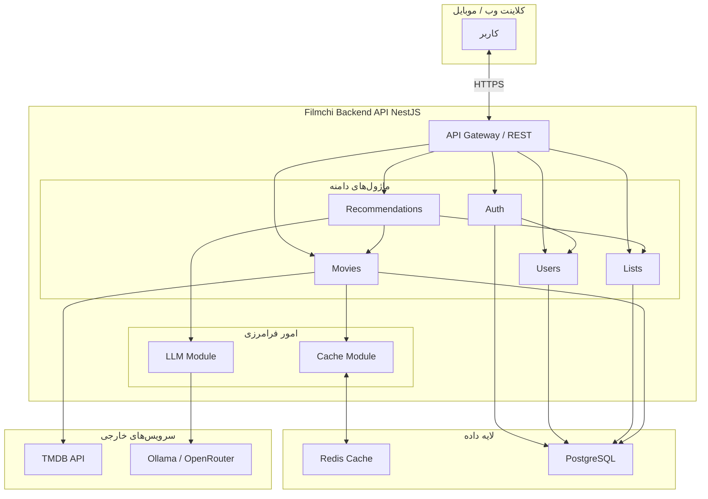
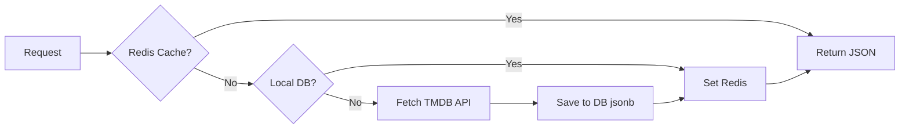
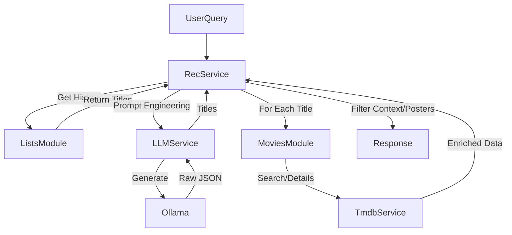

# ۰۳. معماری و طراحی

**English:** [03. Architecture & Design](03-Architecture.md)

---

## ۰. نمودار معماری سیستم

نمای کلی سیستم در سه لایه: کلاینت، API، و سرویس‌های خارجی/داده.

**جریان داده (خلاصه):**
- درخواست کاربر → Gateway → ماژول مربوطه.
- فیلم‌ها: ابتدا Redis، در صورت miss به DB، در صورت نبود به TMDB.
- توصیه‌ها: لیست‌ها از DB، تولید پیشنهاد از LLM، غنی‌سازی از TMDB (با کش).

---

## ۱. ساختار ماژولار (NestJS)

اپلیکیشن به صورت **مونولیت ماژولار** ساختار یافته است. جداسازی مسئولیت‌ها از مرز ماژول‌ها اعمال می‌شود.

| ماژول | مسئولیت | وابستگی بین‌ماژولی |
|:------|:--------|:-------------------|
| `AppModule` | هماهنگی ریشه، پیکربندی، اتصال DB | وارد کردن بقیه |
| `AuthModule` | استراتژی‌های JWT، منطق ورود | استفاده از `UsersModule` |
| `MoviesModule` | رابط TMDB، کش، موجودیت‌های فیلم | استفاده از `CacheModule` |
| `ListsModule` | لیست‌های کاربر (واچ‌لیست)، آیتم‌های لیست | — |
| `RecommendationsModule` | منطق کسب‌وکار پیشنهاد هوشمند | استفاده از `LLMModule`, `ListsModule`, `MoviesModule` |
| `LLMModule` | انتزاع ارائه‌دهنده (Ollama) | — |
| `UsersModule` | پروفایل و دادهٔ امتیازها | — |

## ۲. امور فرامرزی

- **اعتبارسنجی:** `ValidationPipe` سراسری با `class-validator` DTOها را سخت‌گیر (whitelist) می‌کند.
  - *شواهد:* `src/main.ts` (خطوط ۲۲–۲۶).
- **مدیریت خطا:** HttpExceptionهای استاندارد NestJS (`NotFoundException`, `UnauthorizedException`).
- **ثبت رویداد:** `nestjs-pino` هر درخواست را با لاگ JSON ساختاریافته می‌پوشاند (حذف خودکار هدر Authorization).
  - *شواهد:* `src/app.module.ts` (خطوط ۱۹–۲۸).
- **امنیت:**
  - **Helmet:** به‌صورت سراسری در `main.ts`.
  - **Throttler:** محدودیت نرخ (پیش‌فرض ۶۰ درخواست/دقیقه) در `AppModule`.
  - **Guardها:** `JwtAuthGuard` برای مسیرهای محافظت‌شده.

## ۳. جریان داده: استراتژی کش

سیستم از استراتژی **کش چندلایه** برای دادهٔ فیلم برای تاب‌آوری و کارایی استفاده می‌کند.

**تصمیم طراحی کلیدی:**
- *شواهد:* `src/movies/movies.service.ts` → متدهای `searchMovies` و `getMovieDetails`.
- *چرا؟* TMDB محدودیت نرخ و تأخیر دارد. ذخیرهٔ JSON «تمیز» در Postgres (موجودیت `TmdbMovie`) به اپ اجازه می‌دهد حتی در قطع TMDB هم کار کند و در عمل یک آینهٔ محلی از محتوای پرطرفدار بسازد.

## ۴. جریان داده: خط لولهٔ توصیه‌ها

وابستگی بین ماژول‌ها برای برآورده کردن درخواست هوشمند.

## ۵. تصمیم‌های کلیدی معماری

۱. **یکپارچه‌سازی مستقیم Ollama:** به‌جای wrapperهای عمومی هوش مصنوعی، پرامپت‌های مشخص برای Ollama/Llama 3 طراحی شده، از جمله ظرافت‌های زبان فارسی.
   - *شواهد:* `src/llm/services/llm.service.ts` (ساخت پرامپت).
۲. **استقلال آیتم لیست:** آیتم‌های لیست یک اسنپ‌شات از فیلم (`title`, `posterPath`) ذخیره می‌کنند تا join با جدول `TmdbMovie` برای هر نمایش لیست لازم نباشد. این کارایی «نمایش واچ‌لیست» را بهینه می‌کند.
   - *شواهد:* `src/entities/list-item.entity.ts`.
۳. **اعتبارسنجی پیکربندی محیط:** طرح Joi باعث می‌شود در صورت نبود کلید/آدرس، اپ در زمان راه‌اندازی با خطا متوقف شود.
   - *شواهد:* `src/app.module.ts`.

