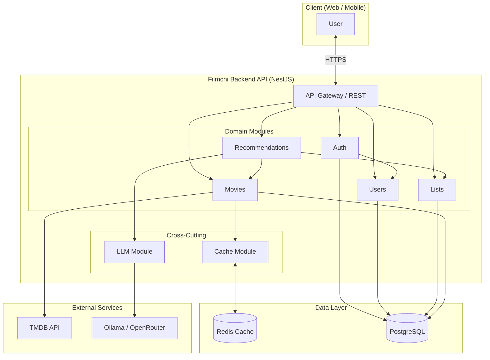
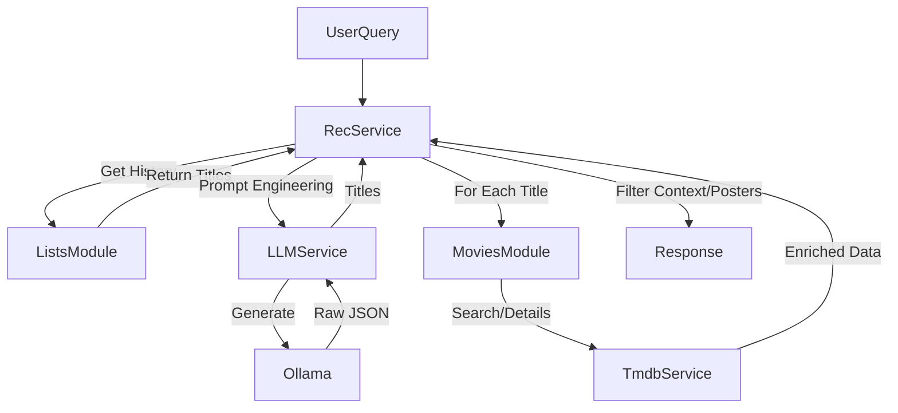

# 03. Architecture & Design

**فارسی (Persian):** [۰۳. معماری و طراحی](03-Architecture.fa.md)

---

## 0. System Architecture Diagram

High-level view of the system in three layers: client, API, and external/data services.



**Data flow (summary):**
- User request → Gateway → relevant module.
- Movies: Redis first, on miss → DB, if not found → TMDB.
- Recommendations: lists from DB, suggestion generation from LLM, enrichment from TMDB (with cache).

---

## 1. Modular Structure (NestJS)
The application is structured as a **Modular Monolith**. Separation of concerns is enforced via module boundaries.

| Module | Responsibility | Inter-module Dependencies |
|--------|----------------|---------------------------|
| `AppModule` | Root orchestration, Config, DB connection | Imports all others |
| `AuthModule` | JWT strategies, Login logic | Uses `UsersModule` |
| `MoviesModule` | TMDB interface, Caching, Movie Entities | Uses `CacheModule` |
| `ListsModule` | User Lists (Watchlist), List Items | - |
| `RecommendationsModule` | Business logic for AI suggestions | Uses `LLMModule`, `ListsModule`, `MoviesModule` |
| `LLMModule` | Provider abstraction (Ollama) | - |
| `UsersModule` | Profile and Ratings data | - |

## 2. Cross-Cutting Concerns
- **Validation:** Global `ValidationPipe` with `class-validator` ensures DTOs are strict (whitelisted).
  - Evidence: `src/main.ts` (lines 22-26).
- **Error Handling:** Standard NestJS HttpExceptions (`NotFoundException`, `UnauthorizedException`).
- **Logging:** `nestjs-pino` wraps every request with structured JSON logging (auto-redacting Authorization headers).
  - Evidence: `src/app.module.ts` (lines 19-28).
- **Security:**
  - **Helmet:** Applied globally in `main.ts`.
  - **Throttler:** Rate limiting (60 requests/min default) configured in `AppModule`.
  - **Guards:** `JwtAuthGuard` used on protected routes.

## 3. Data Flow: Caching Strategy
The system uses a **multi-layer cache** strategy for Movie Data to ensure resilience and performance.

```mermaid
flowchart LR
    Request --> CheckRedis{Redis Cache?}
    CheckRedis -- Yes --> Return[Return JSON]
    CheckRedis -- No --> CheckDB{Local DB?}
    
    CheckDB -- Yes --> UpdateRedis[Set Redis]
    UpdateRedis --> Return
    
    CheckDB -- No --> FetchTMDB[Fetch TMDB API]
    FetchTMDB --> PersistDB[Save to DB (jsonb)]
    PersistDB --> UpdateRedis
```

**Key design decision:**
- Evidence: `src/movies/movies.service.ts` → `searchMovies` and `getMovieDetails` methods.
- Why? TMDB has rate limits and latency. Storing the "clean" JSON in Postgres (`TmdbMovie` entity) allows the app to function even if TMDB is down, effectively building a local mirror of popular content over time.

## 4. Data Flow: Recommendations Pipeline
Dependencies between modules to fulfill an AI request.



## 5. Key Architecture Decisions
1. **Direct Ollama integration:** Instead of generic AI wrappers, specific prompts are engineered for Ollama/Llama 3, including Persian language nuances.
   - Evidence: `src/llm/services/llm.service.ts` (prompt building).
2. **List item independence:** List items store a snapshot of the movie (`title`, `posterPath`) to avoid joining the `TmdbMovie` table for every list view. This optimizes "View Watchlist" performance.
   - Evidence: `src/entities/list-item.entity.ts`.
3. **Environment config validation:** Joi validation schema ensures the app fails at startup if keys/URLs are missing.
   - Evidence: `src/app.module.ts`.
