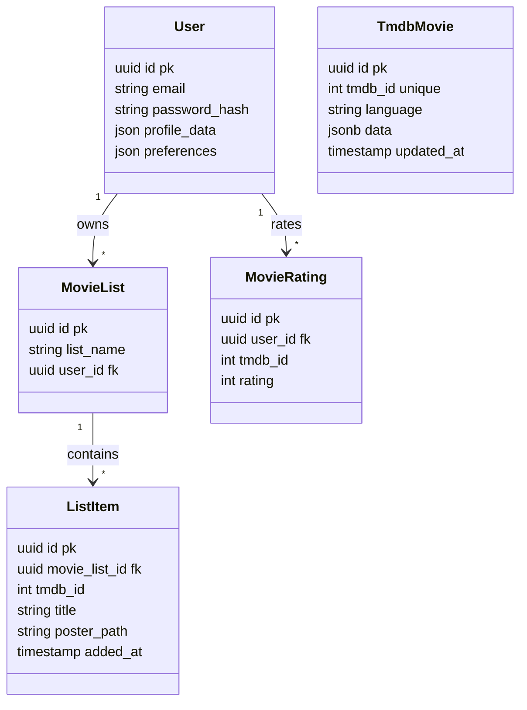

# ۰۵. ERD دیتابیس

**English:** [05. Database ERD](05-Database-ERD.md)

---

## ۱. نمای موجودیت‌ها
دیتابیس از **PostgreSQL** (از طریق TypeORM) استفاده می‌کند. ساختارهای رابطه‌ای (User ↔ Lists) با الگوی document-store (دادهٔ فیلم به‌صورت JSON) ترکیب شده است.

**موجودیت‌های کلیدی:**
۱. **User:** هویت و پروفایل. ستون‌های JSONB برای ترجیحات انعطاف‌پذیر.
۲. **TmdbMovie:** جدول کش. اسنپ‌شات پاسخ‌های API TMDB (ستون `data`) برای کاهش فراخوانی خارجی.
۳. **MovieList:** نگهدارندهٔ لیست‌های کاربر («واچ‌لیست»، «علاقه‌مندی‌ها»).
۴. **ListItem:** جدول شبیه join با حداقل اطلاعات فیلم (`title`, `posterPath`) برای نمایش لیست بدون join با هدر.
۵. **MovieRating:** امتیاز کاربر (۱–۱۰).
۶. **MovieBookmark:** (Legacy/موازی) پیاده‌سازی بوکمارک خاص.

## ۲. ERD با Mermaid

## ۳. انتخاب‌های طرح و مدل‌سازی
- **JSONB برای انعطاف:** `TmdbMovie.data` کل پاسخ JSON را نگه می‌دارد. ترجیحات `User` هم JSON است.
  - *شواهد:* `src/entities/tmdb-movie.entity.ts` (`type: 'jsonb'`).
- **غیرنرمال‌سازی:** `ListItem` مقدار `title` و `posterPath` را کپی می‌کند. با 3NF سازگار نیست ولی کوئری «دریافت واچ‌لیست» را بسیار سریع می‌کند.
- **یکتایی مرکب:** `TmdbMovie` با `[tmdbId, language]` یکتا است. `ListItem` با `[movieListId, tmdbId]` برای جلوگیری از تکرار در لیست.

## ۴. مایگریشن‌ها
۵ مایگریشن در `src/migrations`:
- `...-auto.ts`: تولید طرح اولیه.
- `...-AddMovieBookmark.ts`: جدول بوکمارک جدا.
- `...-AddContentFilterSettings.ts`: فیلتر محتوا برای User.
- `...-AddPosterPathToListItems.ts`: پشتیبانی پوستر برای لیست‌ها.
- `...-AddTmdbMoviesTable.ts`: جدول کش.

