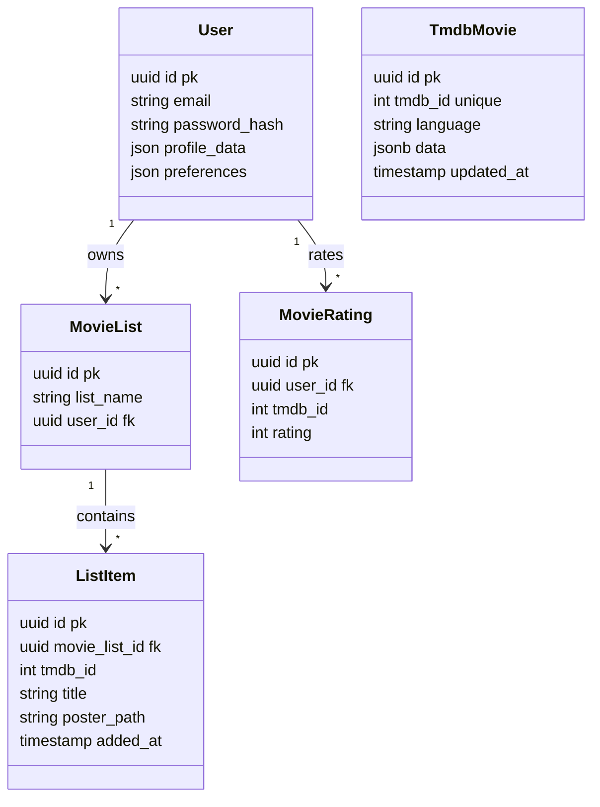

# 05. Database ERD

**فارسی (Persian):** [۰۵. ERD دیتابیس](05-Database-ERD.fa.md)

---

## 1. Entity Overview
The database uses **PostgreSQL** (via TypeORM). It mixes relational structures (User <-> Lists) with document-store patterns (Movie Data as JSON).

**Key Entities:**
1. **User**: Identity and profile. Uses JSONB columns for flexible preferences.
2. **TmdbMovie**: A cache table. Stores a snapshot of TMDB API responses (`data` column) to reduce external calls.
3. **MovieList**: Container for user lists ("Watchlist", "Favorites").
4. **ListItem**: Join-like table holding minimal movie info (`title`, `posterPath`) for list display without joining headers.
5. **MovieRating**: Stores user ratings (1-10).
6. **MovieBookmark**: (Legacy/Parallel) Specific bookmark implementation.

## 2. Mermaid ERD

## 3. Schema & Modeling Choices
- **JSONB for flexibility**: `TmdbMovie.data` stores the entire JSON response. This allows the schema to adapt to TMDB API changes without migrations. `User` preferences are also JSON.
  - *Evidence:* `src/entities/tmdb-movie.entity.ts` (`type: 'jsonb'`).
- **De-normalization**: `ListItem` copies `title` and `posterPath`. This violates 3NF but massively speeds up "Get Watchlist" queries by avoiding a join with `TmdbMovie` (which might not even exist if the user added a movie by ID that hasn't been cached yet).
- **Composite Uniques**: `TmdbMovie` is unique by `[tmdbId, language]`. `ListItem` is unique by `[movieListId, tmdbId]` to prevent duplicates in a list.

## 4. Migrations
Found 5 migrations in `src/migrations`:
- `...-auto.ts`: Initial schema generation.
- `...-AddMovieBookmark.ts`: Added separate bookmark table.
- `...-AddContentFilterSettings.ts`: Added content filters to User.
- `...-AddPosterPathToListItems.ts`: Backfill/Add generic poster support to lists (supports de-normalization strategy).
- `...-AddTmdbMoviesTable.ts`: Added the cache table.
