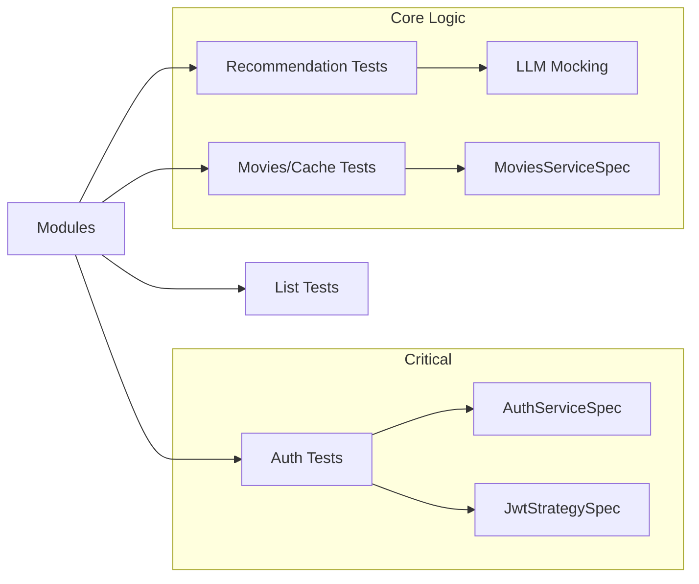
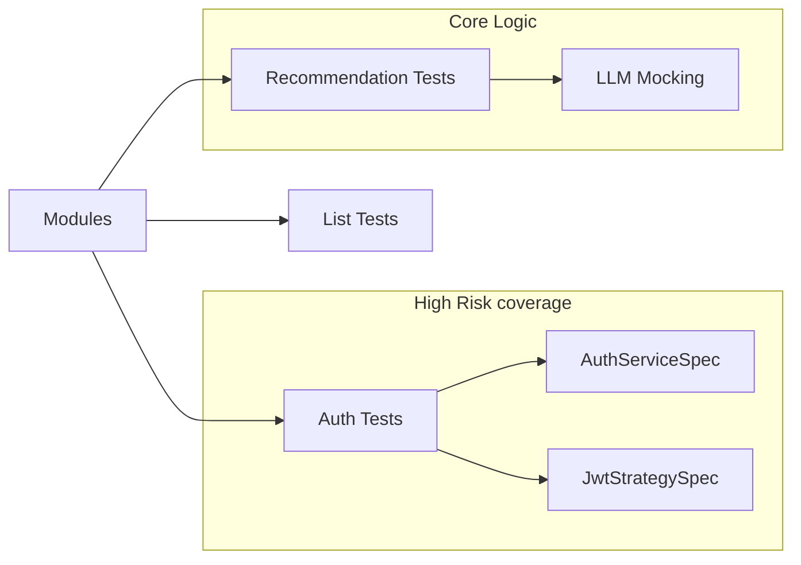

# ۰۶. استراتژی تست و مستند تست

**English:** [06. Testing Strategy & Test Documentation](06-Testing.md)

---

## ۱. موجودی و پوشش

پروژه از **Jest** برای تست واحد و E2E استفاده می‌کند.

- **تست‌های واحد:** در کنار فایل‌های منبع (`*.spec.ts`).
  - پوشش: سرویس‌ها (Auth، Lists، Recommendations، Movies)، کنترلرها.
  - *مثال:* `src/auth/auth.service.spec.ts`، `src/recommendations/recommendations.service.spec.ts`.
- **تست‌های E2E:** در پوشهٔ `test/` (الگوی استاندارد NestJS، با `jest-e2e.json` در package.json).

## ۲. دستورات تست (`package.json`)

| دستور | منظور |
|:------|:------|
| `yarn test` | اجرای تست‌های واحد. |
| `yarn test:e2e` | اجرای تست‌های یکپارچگی (با `test/jest-e2e.json`). |
| `yarn test:cov` | تولید گزارش پوشش. |
| `yarn test:watch` | حالت تماشا برای توسعه. |

## ۳. برنامهٔ تست (مستند تست)

### ۳.۱ جدول سناریوهای تست

| شناسه | نوع | ماژول | سناریو | اولویت |
|:------|:----|:------|:-------|:-------|
| T-01 | Unit | AuthService | ثبت‌نام + هش پسورد | بحرانی |
| T-02 | Unit | AuthService | ورود با credential صحیح/غلط | بحرانی |
| T-03 | Unit | AuthService | تمدید توکن: توکن جدید، نسخهٔ توکن، باطل‌سازی قدیمی | بحرانی |
| T-04 | E2E | Auth | POST /auth/register, /login, /refresh | بحرانی |
| T-05 | Unit | MoviesService | جستجو: استفاده از کش، کلید یکسان | بالا |
| T-06 | Unit | TmdbService | وقتی TMDB خطا می‌دهد، fallback/خالی | بالا |
| T-07 | E2E | Movies | GET /movies/search با/بدون کش | بالا |
| T-08 | Unit | RecommendationsService | با mock LLM: خروجی غنی‌سازی و فیلتر | بالا |
| T-09 | Unit | ListsService | افزودن به لیست، لیست ناموجود (ساخت lazy) | متوسط |
| T-10 | E2E | Lists | POST/GET/DELETE لیست | متوسط |
| T-11 | Unit | Content Filter | IRANIAN_CONTENT_FILTER حذف محتوای بزرگسال | متوسط |

### ۳.۲ نقشهٔ پوشش (خلاصه)

### ۳.۳ ارزیابی و بنچمارک (خارج از تست خودکار)

برای **ارزیابی تأثیر کش** و **ارزیابی پرامپت** از مستند و اسکریپت‌های جداگانه استفاده می‌شود:

| موضوع | مستند | ابزار/روش |
|:------|:------|:----------|
| تأثیر کش روی زمان پاسخ و TMDB | `09-Evaluation.fa.md` §۱ | `scripts/benchmark-cache.sh` |
| رسیدن به پرامپت مناسب و کیفیت پیشنهاد | `09-Evaluation.fa.md` §۲ | کوئری‌های نمونه + چک‌لیست دستی |

جزئیات کامل در **`docs/09-Evaluation.fa.md`**.

## ۴. نقشهٔ پوشش تست (جزئی)

## ۵. مشاهده‌ها و شکاف‌ها

- **تست LLM:** تست‌های واحد `RecommendationsService` پاسخ LLM را mock می‌کنند. تست یکپارچگی واقعی با Ollama در CI دشوار است، بنابراین تکیه بر mock متعارف است.
- **دیتابیس:** تست‌های واحد از SQLite در حافظه (`:memory:`) استفاده می‌کنند (از طریق منطق `app.module.ts`) تا اجرا بدون کانتینر Postgres واقعی سریع باشد.
  - *شواهد:* `src/app.module.ts` خطوط ۷۹–۸۵ (`type: 'sqlite', database: ':memory:'`).

## ۶. برنامهٔ پیشنهادی تست (اولویت بر اساس ریسک)

۱. **بحرانی:** اطمینان از تست سنگین `AuthService.refresh` برای جلوگیری از حلقهٔ بی‌نهایت یا قفل شدن.
۲. **بالا:** منطق کش `TmdbService`. بررسی اینکه در حالت آفلاین داده واقعاً از DB خوانده می‌شود.
۳. **متوسط:** فیلترهای محتوا. اطمینان از اینکه منطق `IRANIAN_CONTENT_FILTER` محتوای بزرگسال را در `MoviesService` درست حذف می‌کند.

