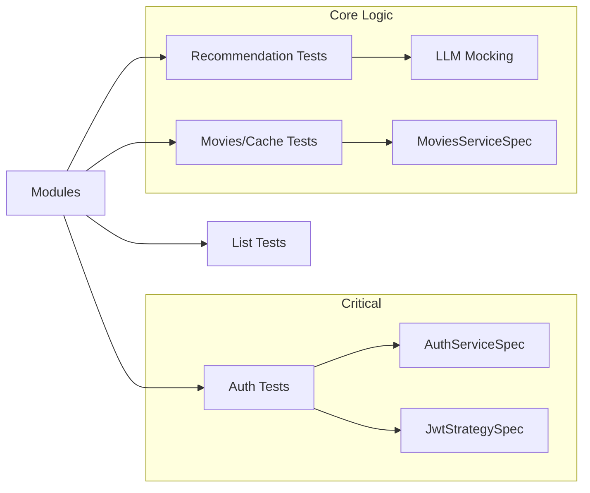
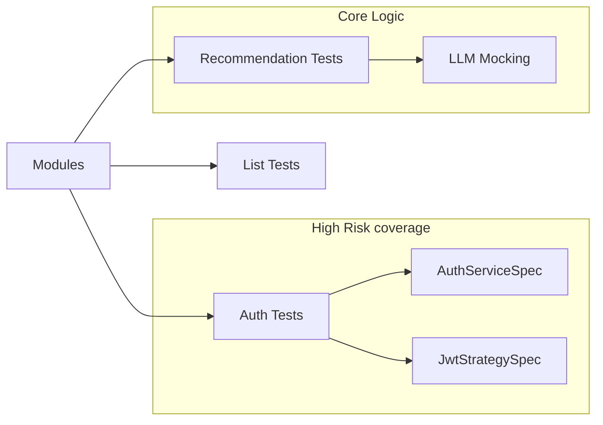

# 06. Testing Strategy & Test Documentation

**فارسی (Persian):** [۰۶. استراتژی تست و مستند تست](06-Testing.fa.md)

---

## 1. Inventory & Coverage
The project uses **Jest** for both Unit and E2E testing.

- **Unit tests:** Located alongside source files (`*.spec.ts`).
  - Coverage: Services (Auth, Lists, Recommendations, Movies), Controllers.
  - Example: `src/auth/auth.service.spec.ts`, `src/recommendations/recommendations.service.spec.ts`.
- **E2E tests:** In `test/` (standard NestJS pattern, via `jest-e2e.json` in package.json).

## 2. Test Commands (`package.json`)
| Command | Purpose |
|---------|---------|
| `yarn test` | Run unit tests. |
| `yarn test:e2e` | Run integration tests (uses `test/jest-e2e.json`). |
| `yarn test:cov` | Generate coverage report. |
| `yarn test:watch` | Watch mode for development. |

## 3. Test Plan
### 3.1 Test Scenario Table

| ID | Type | Module | Scenario | Priority |
|----|------|--------|----------|----------|
| T-01 | Unit | AuthService | Register + password hash | Critical |
| T-02 | Unit | AuthService | Login with valid/invalid credentials | Critical |
| T-03 | Unit | AuthService | Refresh: new token, token version, invalidate old | Critical |
| T-04 | E2E | Auth | POST /auth/register, /login, /refresh | Critical |
| T-05 | Unit | MoviesService | Search: cache usage, same key | High |
| T-06 | Unit | TmdbService | When TMDB errors, fallback/empty | High |
| T-07 | E2E | Movies | GET /movies/search with/without cache | High |
| T-08 | Unit | RecommendationsService | With mock LLM: enrichment and filter output | High |
| T-09 | Unit | ListsService | Add to list, list missing (lazy create) | Medium |
| T-10 | E2E | Lists | POST/GET/DELETE list | Medium |
| T-11 | Unit | Content Filter | IRANIAN_CONTENT_FILTER removes adult content | Medium |

### 3.2 Coverage Map (Summary)

### 3.3 Evaluation & Benchmark (Outside Automated Tests)
For **cache impact evaluation** and **prompt evaluation**, separate documentation and scripts are used:

| Topic | Document | Tool/Method |
|-------|----------|------------|
| Cache impact on response time and TMDB | [09-Evaluation.md](09-Evaluation.md) §1 | `scripts/benchmark-cache.sh` |
| Reaching the right prompt and recommendation quality | [09-Evaluation.md](09-Evaluation.md) §2 | Sample queries + manual checklist |

Full details in **[docs/09-Evaluation.md](09-Evaluation.md)**.

## 4. Test Coverage Map (Detail)

## 5. Observations & Gaps
- **LLM testing:** `RecommendationsService` unit tests mock the LLM response. Real integration testing with Ollama is difficult in CI, so reliance on mocks is expected.
- **Database:** Unit tests use in-memory SQLite (`:memory:`) via `app.module.ts` logic for fast runs without a real Postgres container.
  - Evidence: `src/app.module.ts` lines 79-85 (`type: 'sqlite', database: ':memory:'`).

## 6. Proposed Test Plan (Risk Prioritized)
1. **Critical:** Ensure `AuthService.refresh` is heavily tested to prevent infinite loop or lockout.
2. **High:** `TmdbService` caching logic. Verify data is read from DB when offline.
3. **Medium:** Content filters. Ensure `IRANIAN_CONTENT_FILTER` correctly filters adult content in `MoviesService`.
