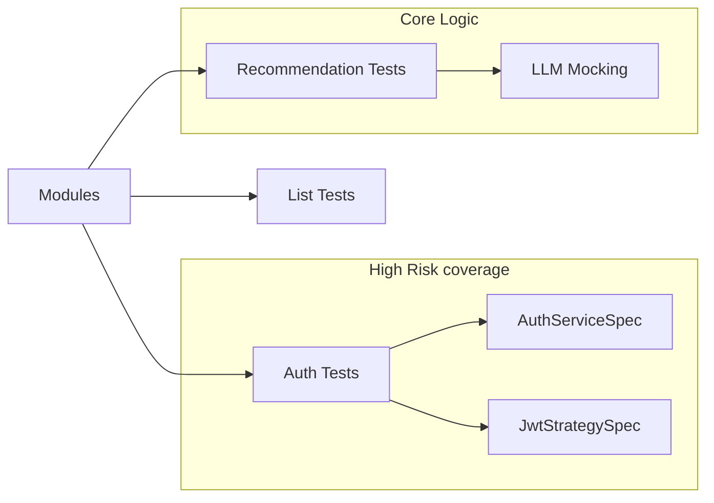

# 06. Testing Strategy

## 1. Inventory & Coverage
The project uses **Jest** for both Unit and E2E testing.

- **Unit Tests**: Found alongside source files (`*.spec.ts`).
  - Covered: Services (Auth, Lists, Recommendations, Movies), Controllers.
  - *Example:* `src/auth/auth.service.spec.ts`, `src/recommendations/recommendations.service.spec.ts`.
- **E2E Tests**: Located in `test/` (standard NestJS pattern, implied by `jest-e2e.json` in package.json).

## 2. Test Commands (`package.json`)
| Command | Purpose |
|---------|---------|
| `yarn test` | Run unit tests. |
| `yarn test:e2e` | Run integration tests (uses `test/jest-e2e.json`). |
| `yarn test:cov` | Generate coverage report. |
| `yarn test:watch` | Watch mode for dev. |

## 3. Test Coverage Map

## 4. Observations & Gaps
- **LLM Testing**: `RecommendationsService` unit tests likely mock the LLM response. Real integration testing with Ollama is difficult in CI, so reliance on mocks is expected.
- **Database**: Unit tests use `:memory:` SQLite (via `app.module.ts` logic), ensuring fast execution without a real Postgres container.
  - Evidence: `src/app.module.ts` lines 79-85 (`type: 'sqlite', database: ':memory:'`).

## 5. Proposed Test Plan (Risk Prioritized)
1. **Critical**: Ensure `AuthService.refresh` is heavily tested to prevent infinite loop or lockout scenarios.
2. **High**: `TmdbService` caching logic. Verify that data is actually read from DB when offline.
3. **Medium**: Content Filters. Ensure `IRANIAN_CONTENT_FILTER` logic correctly filters out adult content in `MoviesService`.
