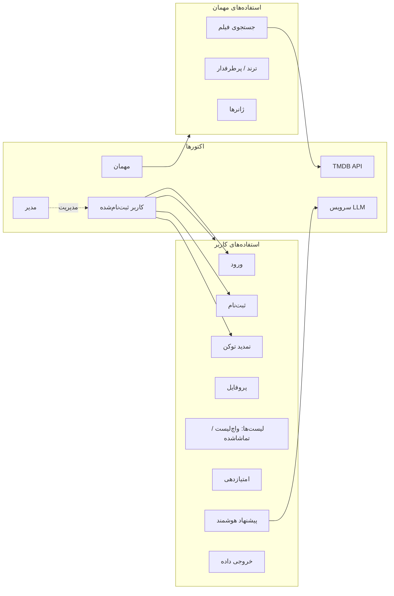
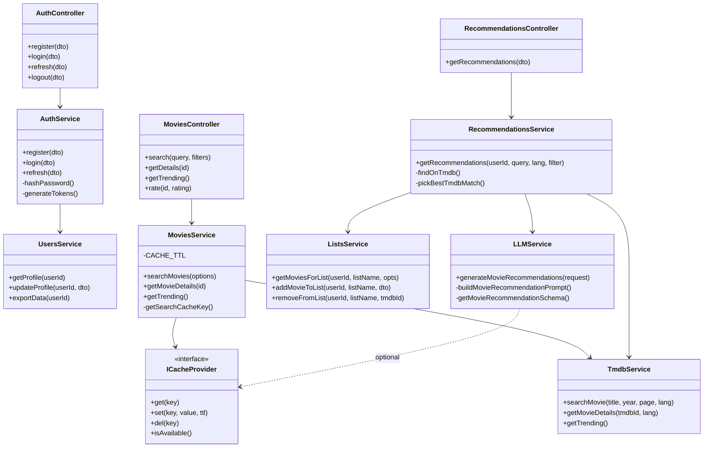
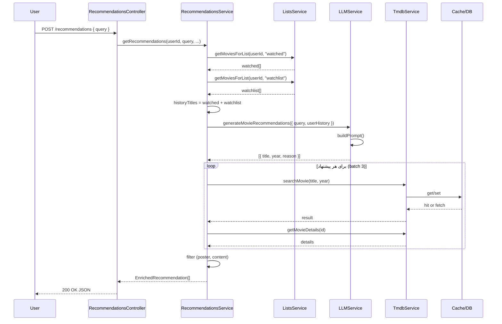
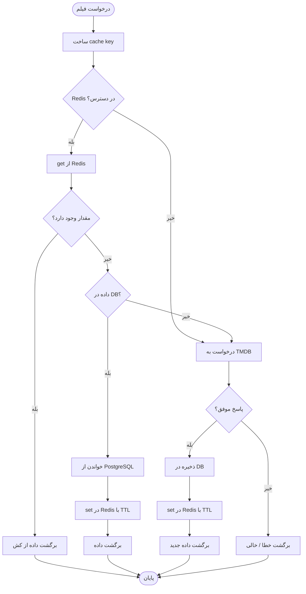

# ۱۰. نمودارهای UML

**English:** [10. UML Diagrams](10-UML-Diagrams.md)

---

این سند نمودارهای UML مورد نیاز برای نشان دادن طراحی مهندسی‌شده سیستم را گردآوری می‌کند.

---

## ۱. نمودار مورد استفاده (Use Case Diagram)

نمای Use Case برای اکتورهای اصلی و موارد استفاده.

**جدول Use Case (خلاصه):**

| شناسه | عنوان | اکتور اصلی | پیش‌نیاز |
|:------|:------|:-----------|:---------|
| UC-01 | ورود | کاربر | ثبت‌نام |
| UC-02 | تمدید توکن | کاربر | توکن منقضی‌شده |
| UC-03 | دریافت پیشنهاد هوشمند | کاربر | ورود، Ollama/LLM |
| UC-04 | افزودن فیلم به لیست | کاربر | ورود |
| UC-05 | مشاهده جزئیات فیلم | مهمان/کاربر | — |
| UC-06 | امتیازدهی به فیلم | کاربر | ورود |
| UC-07 | جستجوی فیلم | مهمان/کاربر | — |
| UC-08 | خروجی داده (Export) | کاربر | ورود |

---

## ۲. نمودار کلاس (لایه دامنه / اپلیکیشن)

نمای کلاس‌های اصلی در لایه سرویس و کنترلر (بدون جزئیات TypeORM/DB).

**توضیح:** ارتباط با دیتابیس از طریق TypeORM Repository در هر سرویس است و برای سادگی در نمودار نیامده است.

---

## ۳. نمودار توالی — دریافت پیشنهاد هوشمند

همان سناریوی UC-03 با تأکید بر ترتیب فراخوانی سرویس‌ها.

---

## ۴. نمودار فعالیت — جریان کش (Cache-Aside) برای فیلم

فعالیت‌های تصمیم‌گیری و مراحل در مسیر درخواست فیلم (جستجو یا جزئیات).

---

## ۵. ارجاع به مستندات مرتبط

| نمودار | جزئیات بیشتر |
|:-------|:-------------|
| Use Case متنی + توالی لاگین/لیست | `02-UseCases.md` · `02-UseCases.fa.md` |
| ERD و مدل دیتابیس | `05-Database-ERD.md` · `05-Database-ERD.fa.md` |
| جریان کش و توصیه | `03-Architecture.md` · `03-Architecture.fa.md` |
| طراحی API | `04-API-Spec.md` · `04-API-Spec.fa.md` |

