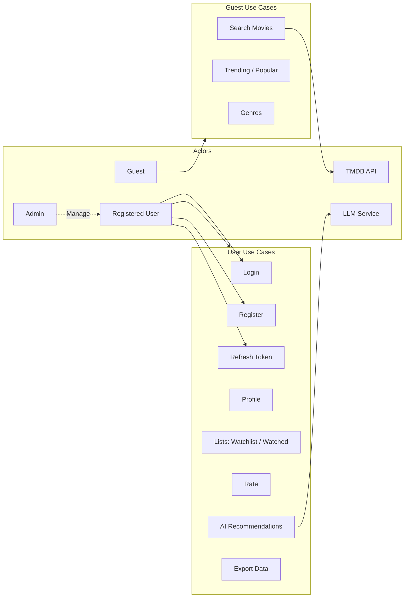
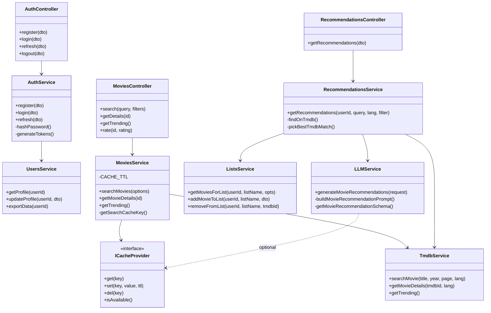
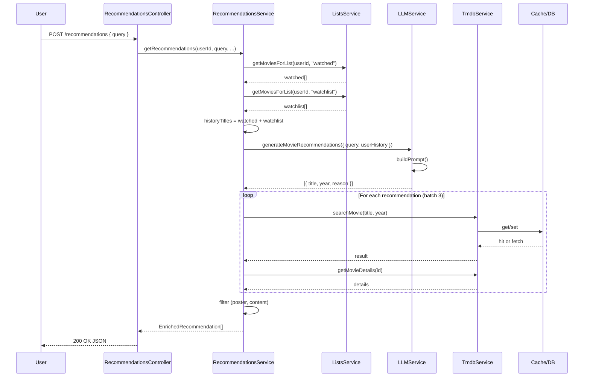
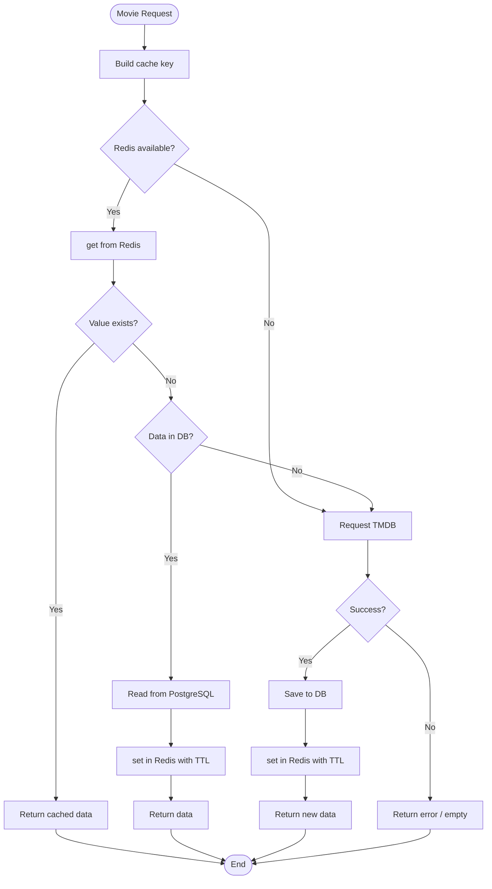

# 10. UML Diagrams

**فارسی (Persian):** [۱۰. نمودارهای UML](10-UML-Diagrams.fa.md)

---

This document collects the UML diagrams used to show the system’s engineered design.

---

## 1. Use Case Diagram

Use case view for main actors and use cases.

**Use Case table (summary):**

| ID | Title | Main Actor | Prerequisite |
|----|-------|------------|--------------|
| UC-01 | Login | User | Registered |
| UC-02 | Refresh token | User | Expired token |
| UC-03 | Get AI recommendations | User | Logged in, Ollama/LLM |
| UC-04 | Add movie to list | User | Logged in |
| UC-05 | View movie details | Guest/User | - |
| UC-06 | Rate movie | User | Logged in |
| UC-07 | Search movies | Guest/User | - |
| UC-08 | Export data | User | Logged in |

---

## 2. Class Diagram (Domain / Application Layer)

Main classes in the service and controller layer (no TypeORM/DB detail).

**Note:** DB access is via TypeORM Repository in each service and is omitted from the diagram for simplicity.

---

## 3. Sequence Diagram — Get AI Recommendations

Same as UC-03, emphasizing service call order.

---

## 4. Activity Diagram — Cache-Aside Flow for Movies

Decision steps and flow for a movie request (search or details).

---

## 5. Related Documentation

| Diagram | More detail |
|---------|-------------|
| Use case text + login/list sequence | [02-UseCases.md](02-UseCases.md) |
| ERD and database model | [05-Database-ERD.md](05-Database-ERD.md) |
| Cache and recommendations flow | [03-Architecture.md](03-Architecture.md) |
| API design | [04-API-Spec.md](04-API-Spec.md) |
