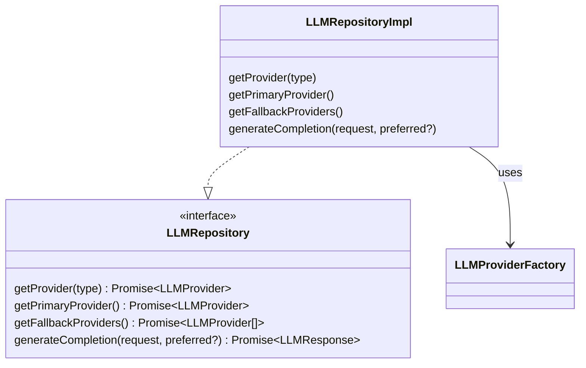
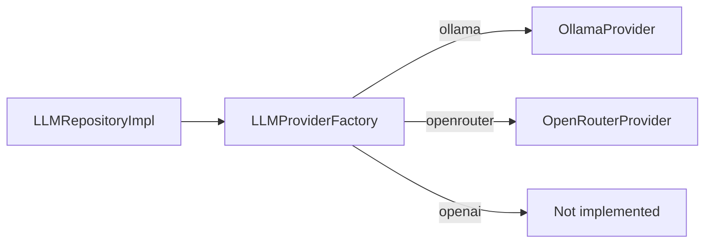
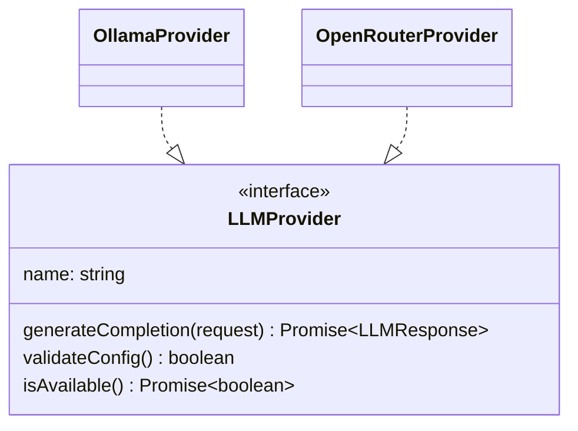
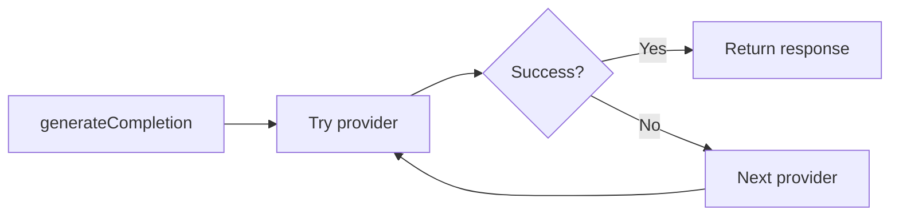

# ۱۱. دیزاین پترن‌ها

**English:** [11. Design Patterns](11-Design-Patterns.md)

---

این سند **دیزاین پترن‌های** به‌کاررفته در بک‌اند Filmchi را شرح می‌دهد، محل استفادهٔ آن‌ها در کدبیس را نشان می‌دهد و توضیح می‌دهد چطور به قابلیت نگهداری، تست‌پذیری و گسترش‌پذیری کمک می‌کنند.

---

## نمای کلی

اپلیکیشن با **NestJS** ساخته شده و ترکیبی از اصطلاحات خود فریم‌ورک و پترن‌های صریح را استفاده می‌کند. پترن‌های زیر در پروژه به کار رفته‌اند:

| پترن | هدف | محل اصلی استفاده |
|:-----|:----|:------------------|
| **ریپازیتوری (Repository)** | انتزاع دسترسی به داده/پروایدر | `LLMModule` |
| **فکتوری (Factory)** | ساخت نمونهٔ پروایدر بر اساس نوع | `LLMProviderFactory` |
| **استراتژی (Strategy)** | الگوریتم‌های قابل تعویض (احراز هویت، LLM) | Passport JWT، `LLMProvider` |
| **الگوی متد قالب (Template Method)** | رفتار مشترک پروایدرهای LLM | `BaseLLMProvider` |
| **لایه سرویس (Service Layer)** | جداسازی منطق کسب‌وکار | کلاس‌های `*Service` |
| **زنجیره مسئولیت / Fallback** | شکست‌خوردگی و تعویض پروایدر LLM | `LLMRepositoryImpl` |

---

## ۱. پترن ریپازیتوری (Repository)

**هدف:** انتزاع **دسترسی به مجموعهٔ اشیا** (یا در اینجا پروایدرها) پشت یک اینترفیس. فراخوان‌ها به اینترفیس وابسته‌اند، نه به ذخیره‌سازی یا پیاده‌سازی پروایدر.

**در پروژه:**
- **LLM:** اینترفیس `LLMRepository` متدهای `getProvider()`، `getPrimaryProvider()`، `getFallbackProviders()` و `generateCompletion()` را تعریف می‌کند.
- `LLMRepositoryImpl` آن را با استفاده از `LLMProviderFactory` و منطق کش/fallback داخلی پیاده می‌کند.
- `LLMService` و جریان پیشنهاد به `LLMRepository` (با تزریق به‌صورت `'LLMRepository'`) وابسته‌اند، نه به پروایدرهای مشخص.

**شواهد:**
- اینترفیس: `src/llm/interfaces/llm-repository.interface.ts`
- پیاده‌سازی: `src/llm/repositories/llm.repository.ts`
- ثبت: `src/llm/llm.module.ts` (`provide: 'LLMRepository', useClass: LLMRepositoryImpl`)

---

## ۲. پترن فکتوری (Factory)

**هدف:** متمرکز کردن **ساخت اشیا** (اینجا پروایدرهای LLM) بر اساس نوع یا پیکربندی. فراخوان نمی‌داند هر پیاده‌سازی چطور ساخته می‌شود.

**در پروژه:**
- `LLMProviderFactory` متد `createProvider(type: LLMProviderType)` دارد که `LLMProvider` برمی‌گرداند.
- بر اساس `OLLAMA`، `OPENROUTER` و غیره سوئیچ می‌کند و `OllamaProvider`، `OpenRouterProvider` و غیره را با وابستگی‌های درست (`HttpService`، `ConfigService`) می‌سازد.
- `createAndValidateProvider()` یک پروایدر می‌سازد و قبل از برگرداندن، پیکربندی و در دسترس بودن را بررسی می‌کند.

**شواهد:** `src/llm/factories/llm-provider.factory.ts`

---

## ۳. پترن استراتژی (Strategy)

**هدف:** خانواده‌ای از **الگوریتم‌های قابل تعویض** پشت یک اینترفیس مشترک تعریف شود. کلاینت از اینترفیس استفاده می‌کند؛ استراتژی مشخص در زمان اجرا یا با پیکربندی انتخاب می‌شود.

**در پروژه:**
- **LLM:** اینترفیس `LLMProvider` با `generateCompletion()`، `validateConfig()`، `isAvailable()`. پیاده‌سازی‌ها: `OllamaProvider`، `OpenRouterProvider` و غیره. «استراتژی» توسط `LLMProviderFactory` انتخاب و توسط `LLMRepositoryImpl` استفاده می‌شود.
- **احراز هویت:** استراتژی JWT در Passport برای احراز هویت استفاده می‌شود. `JwtStrategy` از `PassportStrategy(Strategy)` ارث می‌برد و `validate(payload)` را پیاده می‌کند.

**شواهد:**
- LLM: `src/llm/interfaces/llm-provider.interface.ts`، `src/llm/providers/ollama.provider.ts`، `openrouter.provider.ts`
- احراز هویت: `src/auth/jwt.strategy.ts`

---

## ۴. پترن متد قالب (Template Method)

**هدف:** **اسکلت یک الگوریتم** در یک کلاس پایه تعریف شود، با چند گام پیاده‌سازی‌شده و بقیه abstract تا زیرکلاس‌ها آن‌ها را پر کنند.

**در پروژه:**
- `BaseLLMProvider` یک کلاس abstract است که `LLMProvider` را پیاده می‌کند. متدهای مشترک را فراهم می‌کند:
  - `validateRequest()`، `createResponse()`، `retryWithBackoff()` (رفتار مشترک).
  - اعضای abstract: `name`، `supportedModels`، `generateCompletion()`، `validateConfig()`، `isAvailable()`.
- پروایدرهای مشخص (مثلاً `OllamaProvider`، `OpenRouterProvider`) از `BaseLLMProvider` ارث می‌برند و بخش‌های abstract را پیاده می‌کنند.

**شواهد:** `src/llm/providers/base-llm.provider.ts`، `src/llm/providers/ollama.provider.ts`

---

## ۵. پترن لایه سرویس (Service Layer)

**هدف:** قرار دادن **منطق کسب‌وکار** در کلاس‌های سرویس اختصاصی. کنترلرها نازک می‌مانند (ورودی/خروجی HTTP و فراخوانی سرویس).

**در پروژه:**
- کنترلرها در `auth.controller.ts`، `movies.controller.ts`، `lists.controller.ts`، `recommendations.controller.ts` و غیره عمدتاً ورودی را اعتبارسنجی می‌کنند و به سرویس‌ها فراخوان می‌دهند.
- `MoviesService` — جستجو، جزئیات، کلیدهای کش، جریان TMDB + DB + کش.
- `RecommendationsService` — واکشی لیست، فراخوانی LLM، غنی‌سازی با `TmdbService`.
- `AuthService` — ورود، ثبت‌نام، مدیریت توکن.
- `ListsService` — CRUD لیست‌ها و آیتم‌های لیست.

**شواهد:** هر `*.controller.ts` در مقابل `*.service.ts` مربوطه (مثلاً `src/movies/`، `src/recommendations/`).

---

## ۶. زنجیره مسئولیت / Fallback

**هدف:** ابتدا یک **هندلر (یا پروایدر) اصلی** امتحان شود؛ در صورت شکست، مورد بعدی تا موفقیت یکی یا شکست همه امتحان شود.

**در پروژه:**
- `LLMRepositoryImpl.generateCompletion()` لیستی می‌سازد: پروایدر ترجیحی (در صورت وجود)، سپس اصلی، سپس fallbackها. روی این لیست حلقه می‌زند و `provider.generateCompletion()` را فراخوانی می‌کند تا یکی با موفقیت برگردد؛ در غیر این صورت بعد از شکست همه، خطا پرتاب می‌کند.
- در دسترس بودن پروایدر کش می‌شود و در صورت شکست می‌توان آن را باطل کرد تا درخواست بعدی پروایدر دیگر را امتحان کند.

**شواهد:** `src/llm/repositories/llm.repository.ts` — متد `generateCompletion()` (امتحان پروایدرها به ترتیب و پرتاب خطا پس از آخرین شکست).

---

## جدول خلاصه (با ارجاع فایل)

| پترن | فایل‌های کلیدی |
|:-----|:----------------|
| ریپازیتوری | `src/llm/interfaces/llm-repository.interface.ts`، `src/llm/repositories/llm.repository.ts` |
| فکتوری | `src/llm/factories/llm-provider.factory.ts` |
| استراتژی | `src/llm/interfaces/llm-provider.interface.ts`، `src/llm/providers/*.ts`، `src/auth/jwt.strategy.ts` |
| متد قالب | `src/llm/providers/base-llm.provider.ts` |
| لایه سرویس | `src/**/*.service.ts` |
| زنجیره مسئولیت / Fallback | `src/llm/repositories/llm.repository.ts` (generateCompletion) |

---

این سند با معرفی پترن‌های جدید یا بازنویسی پترن‌های موجود باید به‌روز شود.

