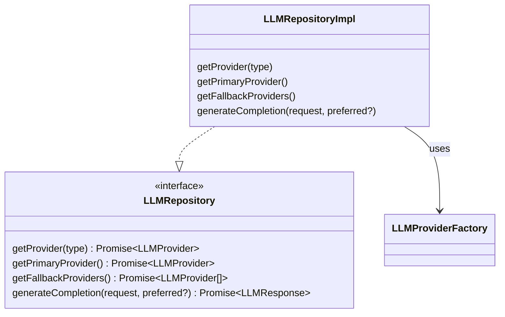
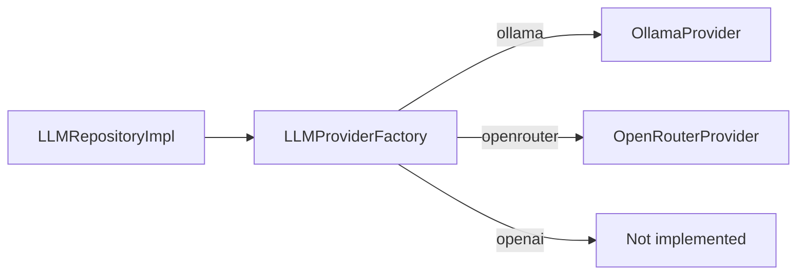
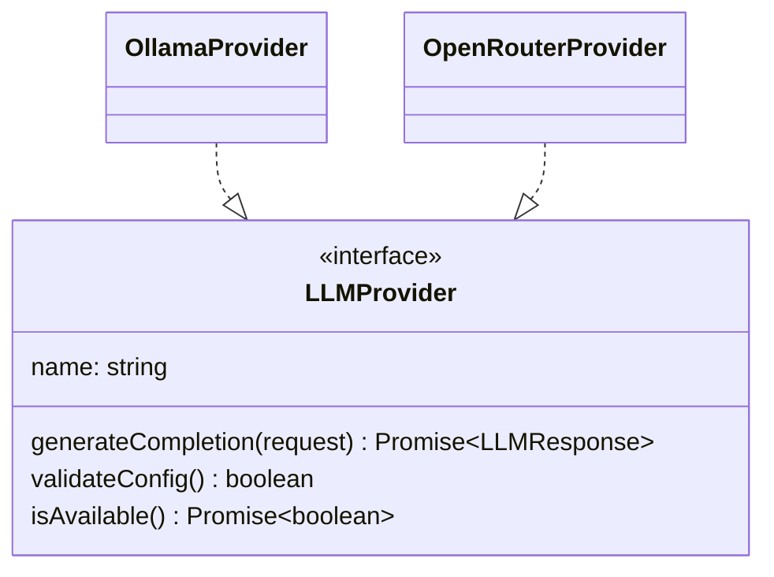
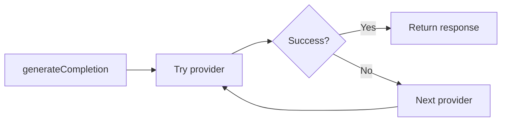

# 11. Design Patterns

**فارسی (Persian):** [11. دیزاین پترن‌ها](11-Design-Patterns.fa.md)

---

This document describes the **design patterns** used in the Filmchi backend application, where they appear in the codebase, and how they support maintainability, testability, and extensibility.

---

## Overview

The application is built with **NestJS** and uses a mix of framework idioms and explicit patterns. The following patterns are used:

| Pattern | Purpose | Main location(s) |
|--------|---------|------------------|
| **Repository** | Abstract data/provider access | `LLMModule` |
| **Factory** | Create provider instances by type | `LLMProviderFactory` |
| **Strategy** | Pluggable algorithms (auth, LLM) | Passport JWT, `LLMProvider` |
| **Template Method** | Shared LLM provider behaviour | `BaseLLMProvider` |
| **Service Layer** | Business logic separation | `*Service` classes |
| **Chain of responsibility / Fallback** | LLM provider failover | `LLMRepositoryImpl` |

---

## 1. Repository Pattern

**Intent:** Abstract **access to a set of objects** (or in this case, to “providers”) behind an interface. Callers depend on the interface, not on the concrete storage or provider implementation.

**In the project:**
- **LLM:** `LLMRepository` interface defines `getProvider()`, `getPrimaryProvider()`, `getFallbackProviders()`, and `generateCompletion()`.
- `LLMRepositoryImpl` implements it using `LLMProviderFactory` and internal caching/fallback logic.
- `LLMService` and recommendation flow depend on `LLMRepository` (injected as `'LLMRepository'`), not on concrete providers.

**Evidence:**
- Interface: `src/llm/interfaces/llm-repository.interface.ts`
- Implementation: `src/llm/repositories/llm.repository.ts`
- Registration: `src/llm/llm.module.ts` (`provide: 'LLMRepository', useClass: LLMRepositoryImpl`)

---

## 2. Factory Pattern

**Intent:** Centralise **creation of objects** (here, LLM providers) based on a type or configuration. The caller does not know how each implementation is built.

**In the project:**
- `LLMProviderFactory` has `createProvider(type: LLMProviderType)` returning `LLMProvider`.
- It switches on `OLLAMA`, `OPENROUTER`, etc., and instantiates `OllamaProvider`, `OpenRouterProvider`, etc., with the right dependencies (`HttpService`, `ConfigService`).
- `createAndValidateProvider()` creates a provider and validates config/availability before returning it.

**Evidence:** `src/llm/factories/llm-provider.factory.ts`

---

## 3. Strategy Pattern

**Intent:** Define a family of **interchangeable algorithms** behind a common interface. The client uses the interface; the concrete strategy can be chosen at runtime or by configuration.

**In the project:**
- **LLM:** `LLMProvider` interface with `generateCompletion()`, `validateConfig()`, `isAvailable()`. Implementations: `OllamaProvider`, `OpenRouterProvider`, etc. The “strategy” is chosen by `LLMProviderFactory` and used by `LLMRepositoryImpl`.
- **Auth:** Passport’s JWT “strategy” is used for authentication. `JwtStrategy` extends `PassportStrategy(Strategy)` and implements `validate(payload)`.

**Evidence:**
- LLM: `src/llm/interfaces/llm-provider.interface.ts`, `src/llm/providers/ollama.provider.ts`, `openrouter.provider.ts`
- Auth: `src/auth/jwt.strategy.ts`

---

## 4. Template Method Pattern

**Intent:** Define the **skeleton of an algorithm** in a base class, with some steps implemented and others left abstract so subclasses can fill them in.

**In the project:**
- `BaseLLMProvider` is an abstract class implementing `LLMProvider`. It provides:
  - `validateRequest()`, `createResponse()`, `retryWithBackoff()` (shared behaviour).
  - Abstract members: `name`, `supportedModels`, `generateCompletion()`, `validateConfig()`, `isAvailable()`.
- Concrete providers (e.g. `OllamaProvider`, `OpenRouterProvider`) extend `BaseLLMProvider` and implement the abstract parts.

**Evidence:** `src/llm/providers/base-llm.provider.ts`, `src/llm/providers/ollama.provider.ts`

---

## 5. Service Layer Pattern

**Intent:** Put **business logic** in dedicated service classes. Controllers remain thin (HTTP in/out, delegation to services).

**In the project:**
- Controllers in `auth.controller.ts`, `movies.controller.ts`, `lists.controller.ts`, `recommendations.controller.ts`, etc., mostly validate input and call services.
- `MoviesService` – search, details, cache keys, TMDB + DB + cache flow.
- `RecommendationsService` – list fetching, LLM call, enrichment via `TmdbService`.
- `AuthService` – login, register, token handling.
- `ListsService` – CRUD for lists and list items.

**Evidence:** Any `*.controller.ts` vs corresponding `*.service.ts` (e.g. `src/movies/`, `src/recommendations/`).

---

## 6. Chain of Responsibility / Fallback Pattern

**Intent:** Try a **primary** handler (or provider); if it fails, try the next in line until one succeeds or all fail.

**In the project:**
- `LLMRepositoryImpl.generateCompletion()` builds a list: preferred provider (if any), then primary, then fallbacks. It iterates over this list and calls `provider.generateCompletion()` until one returns successfully; otherwise it throws after all have failed.
- Provider availability is cached and can be invalidated on failure, so the next call may try another provider.

**Evidence:** `src/llm/repositories/llm.repository.ts` – method `generateCompletion()` (trying providers in order and rethrowing after last failure).

---

## Summary Table (with file references)

| Pattern | Key files |
|--------|-----------|
| Repository | `src/llm/interfaces/llm-repository.interface.ts`, `src/llm/repositories/llm.repository.ts` |
| Factory | `src/llm/factories/llm-provider.factory.ts` |
| Strategy | `src/llm/interfaces/llm-provider.interface.ts`, `src/llm/providers/*.ts`, `src/auth/jwt.strategy.ts` |
| Template Method | `src/llm/providers/base-llm.provider.ts` |
| Service Layer | `src/**/*.service.ts` |
| Chain of responsibility / Fallback | `src/llm/repositories/llm.repository.ts` (generateCompletion) |

---

